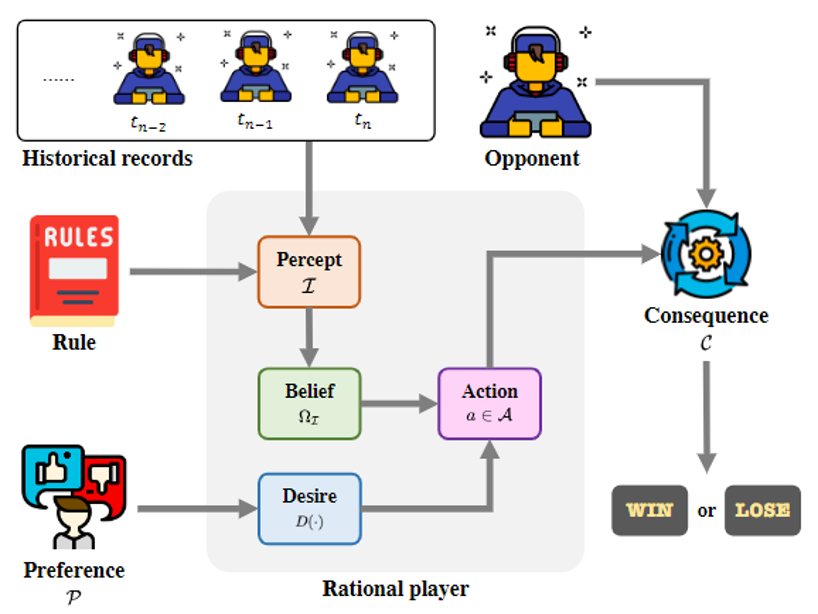
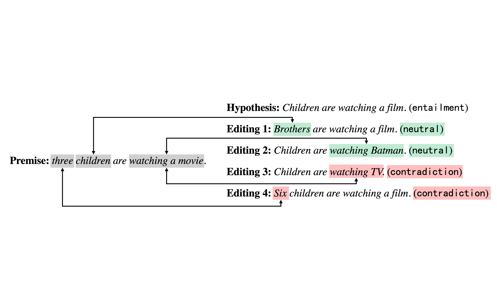

# 第一作者论文

 
 
<b>Caoyun Fan</b>, Jidong Tian, Yitian Li, Hao He, Yaohui Jin. "Comparable Demonstrations are Important in In-Context Learning: A Novel Perspective on Demonstration Selection", <b>ICASSP-2024 (CCF-B)</b>. 
<a href="https://arxiv.org/">[PDF]</a>,
<i><b>TL,DR</b>: Large Language Models may misunderstand the task's essence due to the limited number of demonstrations in In-Context Learning, and Comparable Demonstrations can significantly alleviate this situation. </i>

 
 
<b>Caoyun Fan</b>, Jindou Chen, Yaohui Jin, Hao He. "Can Large Language Models Serve as Rational Players in Game Theory? A Systematic Analysis", <b>AAAI 2024 (CCF-A)</b>. 
<a href="https://arxiv.org/abs/2312.05488">[PDF]</a>,
<i><b>TL,DR</b>: We select three classic games (dictator game, Rock-Paper-Scissors, and ring-network game) to analyze to what extent LLMs can achieve rationality, and we find that even the current state-of-the-art LLM (GPT-4) exhibits substantial disparities compared to humans in game theory. </i>

 
 
<b>Caoyun Fan</b>, Wenqing Chen, Jidong Tian, Yitian Li, Hao He, Yaohui Jin. "Unlock the Potential of Counterfactually-Augmented Data in Out-Of-Distribution Generalization", <b>Expert Systems With Applications 2024 (SCI 一区，IF：8.5)</b>. 
<a href="https://arxiv.org/abs/2310.06666">[PDF]</a>,
<i><b>TL,DR</b>: We theoretically demonstrate two perspectives of using Counterfactually-Augmented Data (CAD) to improve the Out-Of-Distribution (OOD) generalization ability of language models, and propose corresponding constraints, which we call the ECF algorithm. </i>

 
 
<b>Caoyun Fan</b>, Jidong Tian, Yitian Li, Wenqing Chen, Hao He, Yaohui Jin. "Chain-of-Thought Tuning: Masked Language Models can also Think Step By Step in Natural Language Understanding", <b>EMNLP 2023 (CCF-B)</b>. 
<a href="https://arxiv.org/abs/2310.11721">[PDF]</a>,
<i><b>TL,DR</b>: We propose Chain-of-Thought Tuning (CoTT), a two-step reasoning framework based on prompt tuning to implement step-by-step thinking for MLMs on NLU tasks. </i>

 
 
<b>Caoyun Fan</b>, Wenqing Chen, Jidong Tian, Yitian Li, Hao He, Yaohui Jin. "Accurate Use of Label Dependency in Multi-Label Text Classification Through the Lens of Causality", <b>Applied Intelligence 2023 (SCI 二区，IF：5.3)</b>. 
<a href="https://arxiv.org/abs/2310.07588">[PDF]</a>,
<i><b>TL,DR</b>: We find that language models exploit the correlation shortcut in label dependencies in multi-label text classification, and propose a CounterFactual Text Classifier (CFTC) to help language models make causality-based predictions. </i>

 
 
<b>Caoyun Fan</b>, Wenqing Chen, Jidong Tian, Yitian Li, Hao He, Yaohui Jin. "Improving the Out-Of-Distribution Generalization Capability of Language Models: Counterfactually-Augmented Data is not Enough", <b>ICASSP-2023 ORAL (CCF-B)</b>. 
<a href="https://arxiv.org/abs/2302.09345">[PDF]</a>,
<i><b>TL,DR</b>: We attribute the inefficiency of Counterfactually-Augmented Data (CAD) in Out-Of-Distribution generalization to “Myopia Phenomenon” and propose two constraints to unlock the potential of CAD. </i>

 

<b>Caoyun Fan</b>, Wenqing Chen, Jidong Tian, Yitian Li, Hao He, Yaohui Jin. "MaxGNR: A Dynamic Weight Strategy via Maximizing Gradient-to-Noise Ratio for Multi-Task Learning", <b>ACCV-2022 (CCF-C)</b>. 
<a href="https://arxiv.org/abs/2302.09352">[PDF]</a>,
<i><b>TL,DR</b>: We attribute a dynamic weight strategy via maximizing Gradient-to-Noise Ratio in multi-task learning. </i>

# 共同作者论文

Yitian Li, Jidong Tian, <b>Caoyun Fan</b>, Wenqing Chen, Hao He, Yaohui Jin. "MTR: A Dataset Fusing Inductive, Deductive, and Defeasible Reasoning", <b>Findings of ACL-2023 (CCF-A)</b>. 
<a href="https://aclanthology.org/2023.findings-acl.640/">[PDF]</a>

Jidong Tian, Wenqing Chen, Yitian Li, <b>Caoyun Fan</b>, Hao He, Yaohui Jin. "Latent constraints on unsupervised text-graph alignment with information asymmetry", <b>AAAI-2023 (CCF-A)</b>. 
<a href="https://ojs.aaai.org/index.php/AAAI/article/view/26600">[PDF]</a>

Wenqing Chen, Jidong Tian, <b>Caoyun Fan</b>, Yitian Li, Hao He, Yaohui Jin. "Preference-controlled multi-objective reinforcement learning for conditional text generation", <b>AAAI-2023 (CCF-A)</b>. 
<a href="https://ojs.aaai.org/index.php/AAAI/article/view/26490">[PDF]</a>

Yitian Li, Jidong Tian, Wenqing Chen, <b>Caoyun Fan</b>, Hao He, Yaohui Jin. "To What Extent Do Natural Language Understanding Datasets Correlate to Logical Reasoning? A Method for Diagnosing Logical Reasoning", <b>COLING-2022 (CCF-B)</b>. 
<a href="https://aclanthology.org/2022.coling-1.147/">[PDF]</a>

Wenqing Chen, Jidong Tian, <b>Caoyun Fan</b>, Hao He, Yaohui Jin. "Dependent multi-task learning with causal intervention for image captioning", <b>IJCAI-2021 (CCF-A)</b>. 
<a href="https://arxiv.org/abs/2105.08573">[PDF]</a>

