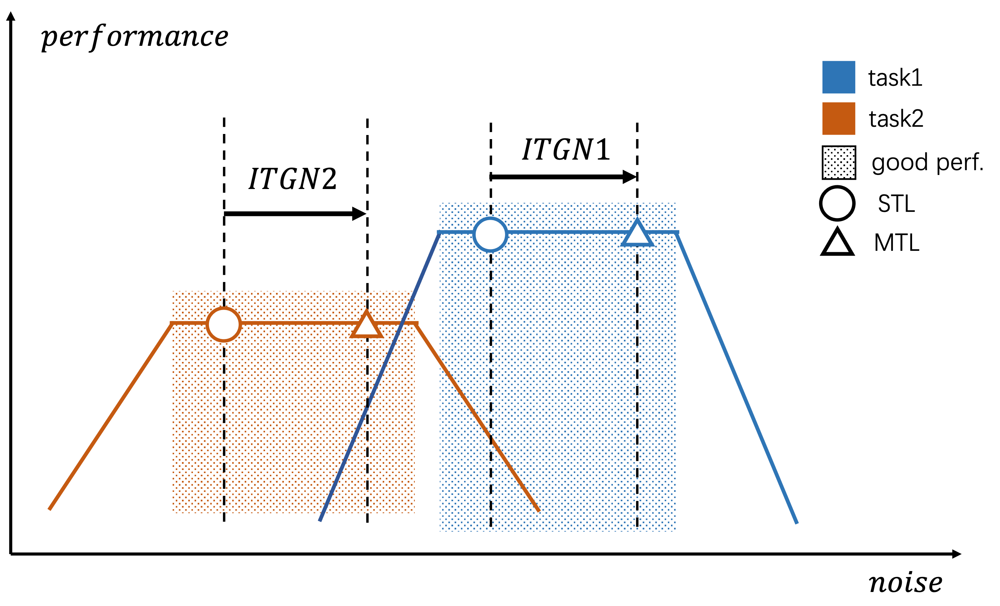

 
 
<b>Caoyun Fan</b>, Jindou Chen, Yaohui Jin, Hao He. "Can Large Language Models Serve as Rational Players in Game Theory? A Systematic Analysis", <b>AAAI 2024 (CCF-A)</b>. 
<a href="https://arxiv.org/abs/2312.05488">[PDF]</a>,
<i><b>TL,DR</b>: A Dynamic Weight Strategy via Maximizing Gradient-to-Noise Ratio in Multi-Task Learning. </i>

 
 
<b>Caoyun Fan</b>, Jidong Tian, Yitian Li, Wenqing Chen, Hao He, Yaohui Jin. "Unlock the Potential of Counterfactually-Augmented Data in Out-Of-Distribution Generalization", <b>Expert Systems With Applications 2024 (SCI 一区，IF：8.5)</b>. 
<a href="https://arxiv.org/abs/2310.06666">[PDF]</a>,
<i><b>TL,DR</b>: A Dynamic Weight Strategy via Maximizing Gradient-to-Noise Ratio in Multi-Task Learning. </i>

 
 
<b>Caoyun Fan</b>, Jidong Tian, Yitian Li, Wenqing Chen, Hao He, Yaohui Jin. "Chain-of-Thought Tuning: Masked Language Models can also Think Step By Step in Natural Language Understanding", <b>EMNLP 2023 (CCF-B)</b>. 
<a href="https://arxiv.org/abs/2310.11721">[PDF]</a>,
<i><b>TL,DR</b>: A Dynamic Weight Strategy via Maximizing Gradient-to-Noise Ratio in Multi-Task Learning. </i>

 
 
<b>Caoyun Fan</b>, Wenqing Chen, Jidong Tian, Yitian Li, Hao He, Yaohui Jin. "Accurate Use of Label Dependency in Multi-Label Text Classification Through the Lens of Causality", <b>Applied Intelligence 2023 (SCI 二区，IF：5.3)</b>. 
<a href="https://arxiv.org/abs/2310.07588">[PDF]</a>,
<i><b>TL,DR</b>: A Dynamic Weight Strategy via Maximizing Gradient-to-Noise Ratio in Multi-Task Learning. </i>

 
 
<b>Caoyun Fan</b>, Wenqing Chen, Jidong Tian, Yitian Li, Hao He, Yaohui Jin. "Improving the Out-Of-Distribution Generalization Capability of Language Models: Counterfactually-Augmented Data is not Enough", <b>ICASSP-2023 ORAL (CCF-B)</b>. 
<a href="https://arxiv.org/abs/2302.09345">[PDF]</a>,
<i><b>TL,DR</b>: A Dynamic Weight Strategy via Maximizing Gradient-to-Noise Ratio in Multi-Task Learning. </i>

 

<b>Caoyun Fan</b>, Wenqing Chen, Jidong Tian, Yitian Li, Hao He, Yaohui Jin. "MaxGNR: A Dynamic Weight Strategy via Maximizing Gradient-to-Noise Ratio for Multi-Task Learning", <b>ACCV-2022 (CCF-C)</b>. 
<a href="https://arxiv.org/abs/2302.09352">[PDF]</a>,
<i><b>TL,DR</b>: A Dynamic Weight Strategy via Maximizing Gradient-to-Noise Ratio in Multi-Task Learning. </i>

